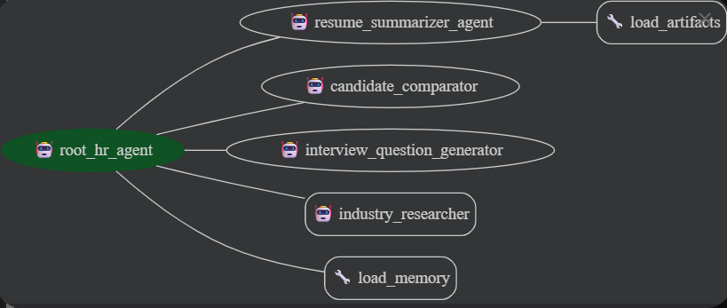

# Hire-Ease AI


## Project Overview
**Hire-Ease AI** is an AI-powered HR automation platform built with **Google's Agent Development Kit (ADK)**.
It uses a **multi-agent architecture** to automate the most time-consuming parts of candidate evaluation:
resume summarisation, skill extraction, candidate comparison, interview question generation, and report creation.

Note: This project is submitted as part of the
[Kaggle Agents Intensive Capstone Project 2025](https://www.kaggle.com/competitions/agents-intensive-course-capstone-2025/)

 \
*Figure 1: Thumbnail generated by Gemini*

## Problem Statement
Nowadays, screening job applicants manually is considered time-consuming, repetitive and often inconsistent. For example, HR teams often face significant bottlenecks:
**1. Resume Overload**
- HR teams must manually review large volumes of resumes or CV to capture candidates skills set. 
- This repetitive process often leads to potential candidates being overlooked and slows down the hiring cycle.

**2. Inconsistency in Evaluation**
- Different recruiters interprets resumes differently, leading to inconsistent assessment across hiring process.
- Without a standardized structure or evaluation logic, there are wide variations in how candidate strengths, weaknesses, and skill relevance are judged.

**3. Slow Hiring Process**
- HR teams must manually write candidate summaries, generate interview questions, maintain consistent evaluation criteria, and even research market salary ranges and up-to-date technologies to ensure candidates are qualified.
- These repetitive administrative tasks reduce the time recruiters can spend on strategic work or meaningful candidate engagement.

## Solution Statement
**Hire-Ease AI** solves these issues by acting as a multi-agent workforce that streamlines the screening process by automating the most time-consuming and repetitive screening tasks. Instead of manually parsing resumes or writing evaluation notes, recruiters receive consistent and ready-to-use insights generated by coordinated AI agents.

The system provides three core functionalities:

**1. Resume Parsing & Structured Summarization**

It extracts key skills and summarizes candidate's resume based on predefined criteria or role-specific requirements to ensure all candidates are evaluated with the same structured logic, reducing human bias and oversight.

**2. Personalized Interview Question Generation**

The system automatically generates well-crafted, role-specific interview questions based on each candidate's background, ensuring deeper and more meaningful conversations during interviews.

**3. Multi-Agent Coordination for Faster & More Accurate Decisions**

By orchestrating these tasks to multi coordinated agents, the hiring process becomes faster, more accurate and effective for HR teams in decision making.

**4. Market-Aware Validation**

Uses a dedicated researcher agent to cross-reference candidate skills with current industry trends using Google Search.

**5. Candidate Comparison**

HR teams can leverage the system to compare multiple candidates against predefined baselines or role-specific criteria, enabling fair, consistent, and data-driven evaluation across the entire talent pool.

## Value Statement
**Hire-Ease AI** reduces the initial screening time by approximately **80%** per candidate. Traditional manual screening requires recruiters to read resumes, extract key information, generate questions, check market standards, and compare candidates. This process often takes **15-20 minutes** per profile. With our coordinated agent workflow, it can complete the same tasks **under 3 minutes**!!
- Efficiency: Reduces resume review time from 15 to 20 minutes to <3 minutes per candidate.
- Quality: Ensures every candidate is asked deep, technical questions relevant to their specific experience, rather than generic templates.

## Architecture & Technical Design
At the core of Hire-Ease AI is the **root_hr_agent**, which acts as the orchestrator for the hiring workflow. It is a modular multi-agent ecosystem, where each agent specializes in a specific stage of the evaluation pipeline.

\
*Figure 2: Agent Architecture*

### The Orchestrator: `root_hr_agent`

This central agent coordinates the entire workflow. It utilizes **Semantic Routing** to interpret user intention (e.g., distinguishing between "Compare these candidates" vs. "Find interview questions") and delegates the task to the appropriate sub-agent. It manages the **Shared Memory (Session State)**, ensuring that context—such as a previously analyzed resume—is retained across different turns of the conversation.

### Sub-Agents and Their Roles
The system decomposes complex HR tasks into four specialized roles:

**1. 📄 Resume Summarizer Agent: `summarizer_agent`**

This agent parses uploaded resumes in PDF format, extracts structured information (skills, experience, education), and produces a concise professional summary. Its role ensures that every candidate is evaluated using consistent logic, reducing bias and preventing oversights.
<br>

**2. ⚖️ Candidate Comparator Agent: `comparator_agent`**

The comparator agent analyzes two or more resumes and generates a side-by-side comparison table based on skill match, experience depth, strengths, and potential gaps. It standardizes what is traditionally one of the least consistent manual HR tasks.
<br>

**3. 🗣️ Interview Question Generator Agent: `question_generator_agent`**

This agent generates technical interview questions based on the candidate's background and the target job role. It can create behavioral, technical, or situational questions, ensuring interviewers are well-prepared without needing manual drafting.
<br>

**4. 👩🏻‍💻 Industry Research Agent: `industry_researcher_agent`**

This agent conducts external market and industry research using integrated tools such as **Google Search**. It identifies industry-standard skills for specific job roles, validates technologies and certifications, analyzes current hiring trends, and enriches job descriptions with reliable, real-world insights.
<br>

## Technical Implementation: Key Concepts Applied
**Hire-Ease AI** demonstrates the practical application of specific concepts from the course curriculum:

**1. Multi-Agent Orchestration**

- The type of agent being implemented is agent powered by an LLM. The `root_hr_agent` acts as the router. It receives natural language requests and determines which specialized agnet is needed. For example, if a user uploads a file, it routes to the `summarizer_agent`. 

**2. Tool User (Built-in)**

- Built-in Tool (Google Search): The `industry_reasearcher_agent` utilizes the ADK's `Google Search` tool. This enables the agent to verify candidate's listed skills are up-to-date with the market standar's and get latest market's information like salary range, reducing hallucinations.

**3. Session & State Management**

- Implementation: `InMemorySessionService` is utilized to maintain conversation history. This enables "Contextual Follow-up." A recruiter can upload a resume, receive a summary, and then simply ask, "Generate 5 interview questions based on this," without needing to re-upload the file. The agent retains the context of the previously analyzed candidate in its session memory.

## Essential Tools and Utilities
**1. Artifact Loader (`load_artifacts`)**
- Allows agents to retrieve previously uploaded files (such as PDF resumes or job descriptions) from the artifact store.
- Useful for workflows involving multiple candidates, multi-step evaluations, or comparisons across stored artifacts.

<br>

**2. Resume File Handling (`SaveFilesAsArtifactsPlugin`)**
- Allows users to upload resumes (PDFs) directly through the web ADK interface.

<br>

**3. Memory Tools (`load_memory`)**
- Enables agents to recall session context, store past interactions, and support iterative conversation workflows.

<br>

**4. Session Runner (`Runner`)**
- Coordinates execution of the full agent system, ensuring state management across requests and enabling more advanced workflows.

<br>

**5. Google Search Tool (`google_search`)**
- Used exclusively by the `industry_researcher_agent` to retrieve real-world, up-to-date industry insights.
- Supports role research, skill validation, technology verification, and labor-market trend enrichment.

<br>

## Effective Use of Gemini
This agent is powered by **Google Gemini 2.5 Flash**. I specifically choose these LLM model is because of:
- Multimodal Native: The LLM can "see" complex PDF layouts (tables, columns) in resumes, ensuring accurate data extraction.

- Ultra-Low Latency: Its extreme speed ensures that routing user requests to the correct sub-agent happens instantly, keeping the chat interface snappy.

- Long Context Window: The massive context window allows the comparator_agent to load and analyze multiple full-length technical CVs simultaneously without truncation.

## Conclusion
**Hire-Ease AI** demonstrates that the future of hiring is not about replacing humans, but empowering them. By leveraging the Google Agent Development Kit and the multimodal power of Gemini 2.5 Flash, the static, manual process of resume screening had been transformed into a dynamic, intelligent workflow.

This project proves that agents can do more than just chat—they can read complex documents, research market reality, and reason through data to solve real-world bottlenecks. With Hire-Ease AI, recruiters stop drowning in paperwork and start focusing on what matters most: connecting with talent.

## Installation & Setup
This project requires **Python 3.12** and uses [**uv**](https://github.com/astral-sh/uv) for dependency management.

### 1. Clone the Repository
```bash
git clone https://github.com/yccccc12/5-Day-AI-Agents-Intensive-Course-with-Google.git
cd Agents-Intensive-Capstone-Project-2025
```

### 2. Project Structure
```
Agents-Intensive-Capstone-Project-2025/
├── hr_agent/
│   ├── sub_agents/            # Collection of sub-agents
│   ├── agent.py               # Agent definition
│   └── prompt.py              # Prompt Template for each agents
├── assets/                    # Architecture diagrams and images
├── pyproject.toml             # Project dependencies
├── uv.lock                    # Lock file for reproducible builds
└── README.md                  # Documentation
```

### 3. Install uv (if not installed)
```bash
# On macOS/Linux
curl -LsSf https://astral.sh/uv/install.sh | sh

# On Windows
pip install uv
```

### 4. Sync Dependencies
Once uv is installed, you can install the project's dependencies:
```bash
uv sync
```
This will create a virtual environment for the project and install all the required libraries.

### 5. Configure Environment Variables
i. Locate the `.env.example` file in the root directory. \
ii. Create a copy named `.env`\
iii. Open the `.env` file and add your **Gemini API Key** \

### 6. Run the Agent
First, activate the virtual environment
```bash
.venv\Scripts\activate
```

Then, run the main agent:
```bash
adk web
```

Inside the interactive playground, select `hr_agent` at the top left corner.
